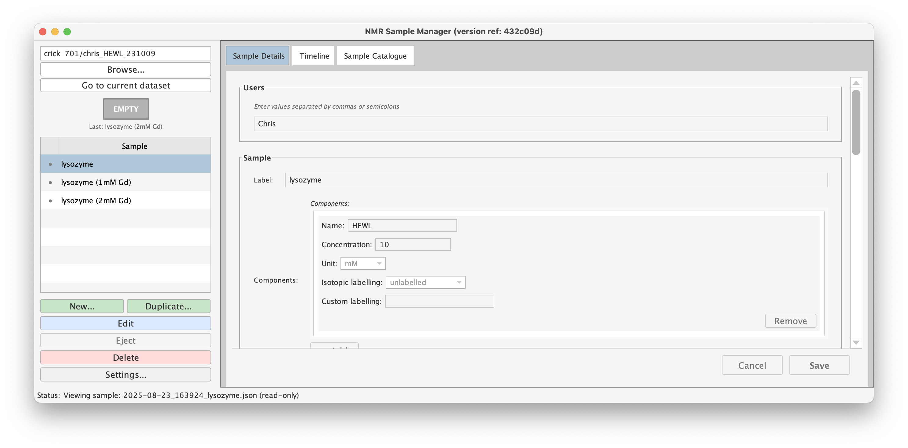
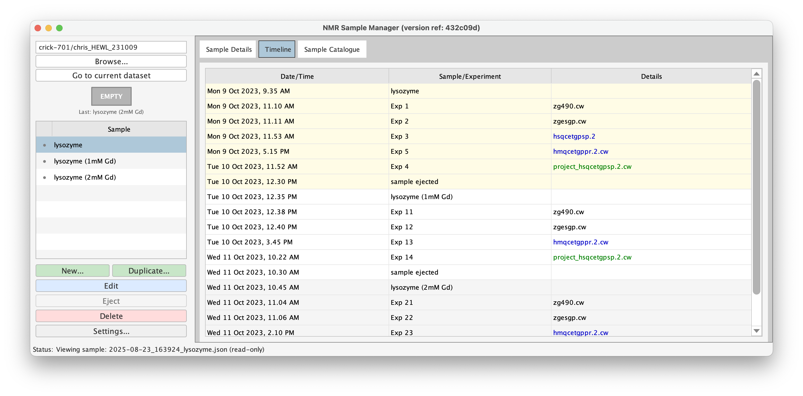

# NMR Sample Manager for TopSpin

[](https://waudbygroup.github.io/topspin-samples/)

A lightweight sample metadata management system for Bruker TopSpin, built using the internal python interface.





## Overview

NMR workflows focus on data acquisition and processing, but sample tracking has been a longstanding blind spot. Bruker TopSpin manages *experiments* effectively, but provides no systematic way to record or retrieve information about *samples* -- e.g. protein concentrations, buffer compositions, isotopic labelling schemes, chemical shift referencing, NMR tube types. This often causes problems when looking back over old data or preparing data for repository submission.

This tool provides a simple JSON schema for recording sample metadata, creating a lightweight, parallel system that captures sample information alongside TopSpin workflows.

### Related Repository

The JSON schema used by this tool is maintained separately in the [nmr-sample-schema](https://github.com/waudbygroup/nmr-sample-schema) repository. This allows the schema to be used independently in other applications and tools.

## Features

- **TopSpin Integration**: Runs natively within TopSpin
- **GUI Interface**: Java Swing-based interface with form-based metadata entry
- **Timeline View**: Chronological visualization of samples and experiments
- **Schema Validation**: JSON Schema-based validation ensures data consistency
- **Version Control**: Schema versioning with migration support
- **Auto-Navigation**: Automatically opens current dataset directory
- **Sample Lifecycle**: Track sample creation, modification, and ejection timestamps

## Installation

1. Clone this repository to a suitable directory (N.B. you cannot use locations within `/opt/topspin...`):
   ```bash
   cd /path/to/installation/directory/
   git clone https://github.com/waudbygroup/topspin-samples.git
   ```

2. Use `setres` in Topspin and add the `src` directory within the topspin-samples folder to the python paths.

3. The application will now be available as TopSpin Python commands.

4. To update the app, open a terminal and navigate to the topspin-samples folder, then pull any updates:
   ```bash
   cd /path/to/installation/directory/topspin-samples
   git pull
   ```

## Usage

### Main Commands

- **`samples`** - Launch the main sample manager GUI
  - Opens GUI and navigates to current dataset
  - If already open, brings window to front and updates directory

- **`ija`** - Inject-and-Annotate (create new sample with auto-eject of previous)
  - Creates new sample entry with current timestamp
  - Automatically ejects any previously active sample

- **`eja`** - Eject-and-Annotate (mark current sample as ejected)
  - Adds ejection timestamp to active sample
  - Placeholder for physical ejection integration

### GUI Features

#### Directory Navigation
- **Browse...** - Select any NMR data directory
- **Go to current dataset** - Navigate to TopSpin's current dataset

#### Sample Management
- **New...** - Create new sample (auto-ejects previous active sample)
- **Duplicate...** - Copy existing sample as template
- **Edit** - Modify sample metadata (read-only view by default, edit on double-click)
- **Mark as Ejected** - Mark active sample as ejected (only enabled for active samples)
- **Delete** - Remove ejected samples (disabled for active samples)

#### Status Badge
- **ACTIVE** (green) - Shows currently loaded sample
- **EMPTY** (grey) - No active sample
- **DRAFT** (amber) - Unsaved new/duplicated sample

#### Timeline View
- Chronological display of samples and experiments
- Experiment entries parsed from acqus files
- Color coding by dimensionality (PARMODE):
  - Green: 3D+ experiments
  - Blue: 2D experiments
  - Black: 1D experiments
- Conditional holder column (shown when rack positions differ)
- Double-click experiments to open in TopSpin

## Data Model

### File Naming Convention
```
YYYY-MM-DD_HHMMSS_samplename.json
2025-10-09_143022_MyProtein.json
```

### Schema Structure

Sample metadata is stored as human-readable JSON files:

```json
{
  "Users": ["researcher1", "researcher2"],
  "Sample": {
    "Label": "MyProtein_pH7",
    "Components": [{
      "Name": "MyProtein",
      "Isotopic labelling": "15N",
      "Concentration": 500,
      "Unit": "uM"
    }]
  },
  "Buffer": {
    "Components": [{"name": "Tris-HCl", "Concentration": 50, "Unit": "mM"}],
    "pH": 7.4,
    "Chemical shift reference": "DSS",
    "Solvent": "10% D2O"
  },
  "NMR Tube": {
    "Diameter": "5 mm",
    "Type": "shigemi",
    "Sample Volume (μL)": 350,
    "SampleJet Rack Position": "A3",
    "SampleJet Rack ID": "Rack-001"
  },
  "Laboratory Reference": {
    "Labbook Entry": "LB2025-08-001",
    "Experiment ID": "EXP-042"
  },
  "Notes": "Sample prepared for HSQC experiments",
  "Metadata": {
    "schema_version": "0.0.3",
    "created_timestamp": "2025-10-09T14:30:22.000Z",
    "modified_timestamp": "2025-10-09T14:35:10.000Z",
    "ejected_timestamp": "2025-10-09T16:45:00.000Z"
  }
}
```

### Schema Versioning

- Current version: **0.0.3**
- Schemas stored in `src/schemas/versions/`
- `src/schemas/current/schema.json` points to active schema
- Old samples automatically load with their original schema version
- New/duplicated samples use current schema version

## Technical Details

### Architecture

- **Platform**: Jython 2.7.2 + Java 11
- **GUI Framework**: Java Swing
- **Persistence**: Java System Properties (singleton pattern)
- **Data Format**: JSON with JSON Schema validation
- **TopSpin Integration**: EXEC_PYSCRIPT for command thread execution

### Key Components

- `samples.py` - Main GUI application
- `ija.py` - Inject-and-Annotate command
- `eja.py` - Eject-and-Annotate command

### Singleton Pattern

The application uses Java System Properties to maintain a single persistent instance across script executions within the same TopSpin session. This allows:
- State preservation between command invocations
- External script control of running GUI
- Window hide/show without data loss

## Development

### Project Structure

```
topspin-samples/
├── src/
│   ├── samples.py           # Main GUI application
│   ├── ija.py               # Inject command
│   ├── eja.py               # Eject command
│   ├── lib/
│   │   ├── schema_form.py   # Form generation
│   │   ├── sample_io.py     # File I/O
│   │   └── timeline.py      # Timeline logic
│   └── schemas/
│       ├── current/
│       │   └── schema.json  # Active schema (v0.0.3)
│       └── versions/
│           ├── v0.0.1/
│           │   └── schema.json
│           ├── v0.0.2/
│           │   └── schema.json
│           └── v0.0.3/
│               └── schema.json
├── CLAUDE.md                # Development documentation
├── README.md                # This file
└── CONTRIBUTORS.md
```

### Requirements

- Bruker TopSpin with Jython 2.7.2
- Java 11 or later
- Pure Python libraries only (no C extensions)

## Contributing

Contributions are welcome! Get in touch with Chris!
<!-- Please see [CONTRIBUTORS.md](CONTRIBUTORS.md) for details. -->

## Citation

If you use this tool in your research, please cite:

[Citation information to be added]

<!-- ## Acknowledgments

See [CONTRIBUTORS.md](CONTRIBUTORS.md) for a full list of contributors. -->
