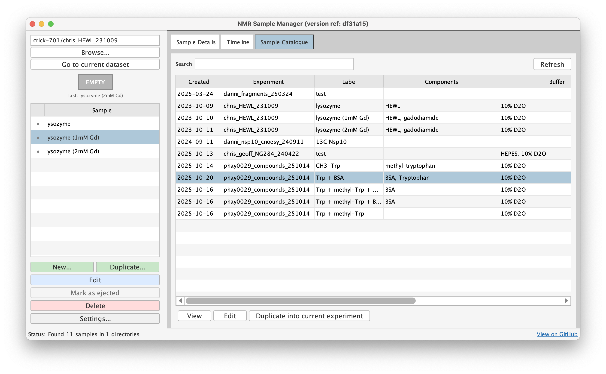
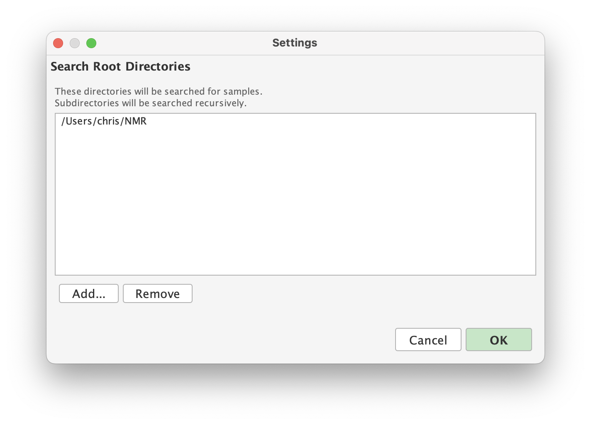
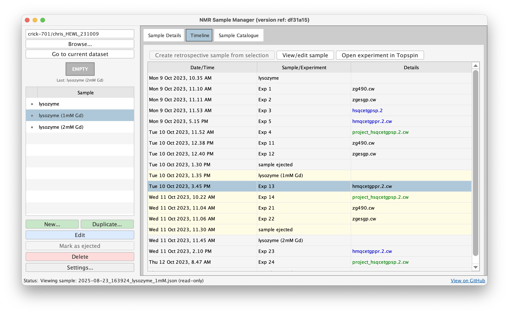

# Usage Guide

This guide covers all features of Sample Manager. For a quick introduction, start with the [Quick Start Guide](../getting-started/quickstart.md).

## Main Interface

Type `samples` in TopSpin to launch the GUI. The window opens and automatically navigates to your current dataset's directory.



The interface has directory navigation at the top, two tabs (Samples and Timeline) in the middle, and action buttons at the bottom. The status bar shows the current directory, active sample status, and number of samples found.

## Directory Navigation

Use "Browse..." to select any NMR data directory, or "Go to current dataset" to navigate to TopSpin's active dataset. The catalogue view shows all samples across your configured root directories with search and filtering capabilities.


Configure root directories via the "Settings..." button to enable multi-directory browsing.



## Sample Management

The Samples tab displays all sample JSON files in the current directory, showing filename, status (ACTIVE or ejection time), sample label, and users. Click a sample to select it, activating the relevant action buttons.

### Creating Samples

Click "New..." to create a sample. Fill in the form fields (all optional) and save. The sample file uses the format `YYYY-MM-DD_HHMMSS_[label].json`. Creating a new sample automatically ejects any previously active sample in the directory, enforcing the "one active sample" rule.

### Editing Samples

Select a sample and click "Edit" (or double-click) to modify it. Make changes and save. The `modified_timestamp` updates automatically. Samples display in read-only mode initially.

### Duplicating Samples

Select a sample and click "Duplicate..." to copy it as a template. Modify the fields for the new sample and save. This is useful for creating similar samples where only a few parameters change.

### Ejecting Samples

Select the active sample and click "Mark as Ejected" to add an ejection timestamp. This marks when the sample was removed from the spectrometer. This button is only enabled for active (non-ejected) samples.

### Deleting Samples

Select an ejected sample and click "Delete" to permanently remove the JSON file. Active samples cannot be deleted - they must be ejected first.

## Timeline View

The Timeline tab shows a chronological view combining samples and experiments in the current directory.



Each row shows either a sample event (Created/Ejected) or an experiment with details like date/time, type, label, nucleus, and number of scans. Experiments are color-coded by dimensionality: black for 1D, blue for 2D, green for 3D+. Double-click any experiment to open that dataset in TopSpin.

The Holder column only appears when samples have different SampleJet rack positions. Timeline automatically sorts chronologically using timestamps for samples and directory numbers for experiments.

### Retrospective Sample Creation

Right-click in the timeline and select experiments to create a retrospective sample entry. This is useful when annotating old data or when you forgot to create a sample during acquisition.


## The Sample Form

When creating or editing samples, you'll see a form with several sections. All fields are optional.


**People** - Users and research groups working with the sample.

**Sample** - Label and components with name, concentration, unit, and isotopic labelling. Multiple components can be added for complex samples.

**Buffer** - pH, solvent, chemical shift reference, and buffer components. Each component has name, concentration, and unit.

**NMR Tube** - Diameter, type, sample volume, SampleJet rack position, and rack ID.

**Laboratory Reference** - Sample ID and labbook entry for cross-referencing external documentation.

**Notes** - Free-form text for additional information.

**Metadata** - Automatically managed fields including schema_version, created_timestamp, modified_timestamp, and ejected_timestamp.

## Integration Commands

Sample Manager provides TopSpin commands for workflow integration:

**`ija` (inject and annotate)** - Run when loading a new sample. Opens Sample Manager, creates a new sample form, navigates to current dataset, and auto-ejects any previous active sample.

**`eja` (eject and annotate)** - Run when removing a sample. Finds the active sample and adds an ejection timestamp.

These commands combine physical and metadata steps for seamless integration.

## File Management

Sample metadata is stored as JSON files in your NMR data directories:

```
/data/user/project/
├── 2025-10-23_143022_sample1.json
├── 2025-10-23_163045_sample2.json
├── 1/ 2/ 3/ ...
```

Files use human-readable JSON format following the schema. You can edit them manually in a text editor, but be careful with JSON syntax. The GUI is recommended for most users to avoid validation errors.

## Schema Versioning

New samples use the current schema version (shown in status bar). When opening old samples created with previous schema versions, Sample Manager automatically loads the correct historical schema. When you save, the sample is upgraded to the current schema version.

If a sample requires a schema version that's not installed, an error panel displays with instructions to update your installation via `git pull`.

## Application Persistence

Sample Manager uses a persistent singleton pattern. Running `samples` multiple times doesn't create multiple windows - it brings the existing window to front. The application maintains state across invocations, clearing only when you restart TopSpin. Close the window to hide it while preserving state.

---

Questions? [Contact us](mailto:c.waudby@ucl.ac.uk) or [open an issue](https://github.com/waudbygroup/topspin-samples/issues).
