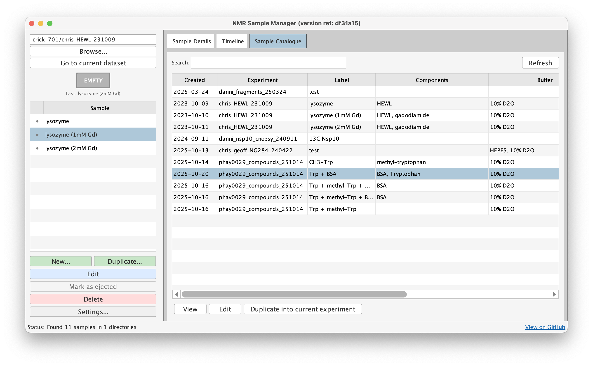
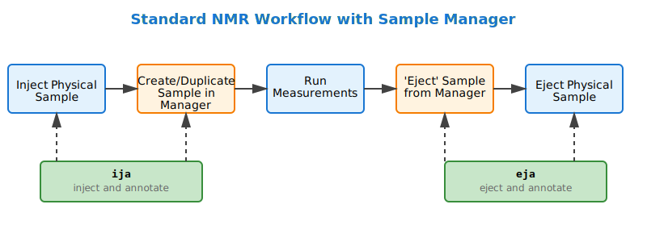

# NMR Sample Manager for TopSpin

A lightweight sample metadata management system that runs natively within Bruker TopSpin, helping you track what's in your NMR tube alongside your spectral data.

## The Problem

NMR spectroscopy has excellent software for managing experiments, but sample tracking has always been a blind spot. When you return to old datasets months or years later, can you confidently answer what the protein concentration was, what buffer was used, or what isotopic labeling scheme was employed? Most NMR users rely on lab notebooks, inconsistent text files, or memory, which becomes a real problem when preparing data for repository submission, writing publications, or troubleshooting experiments.

## The Solution

Sample Manager creates a parallel tracking system alongside TopSpin's experiment management using simple JSON files stored with your NMR data. It provides structured metadata capture, requires no databases or servers, and the text-based format works seamlessly with version control systems like git.

## Workflow

Sample Manager integrates directly into your standard NMR workflow:

The `ija` (inject and annotate) and `eja` (eject and annotate) commands combine the physical and metadata steps, making the process seamless. Simply type `ija` when you load a sample, fill in the form, then type `eja` when you remove it.

## Key Features

**TopSpin Integration.** Runs entirely within TopSpin's Jython environment with no external dependencies. The `samples` command launches the GUI, while `ija` and `eja` provide workflow integration.

**Form-Based Data Entry.** The interface is automatically generated from the JSON schema, so you never need to remember field names or formatting rules. All fields are optional, allowing you to capture what's relevant for each sample.

**Timeline View.** See your samples and experiments together in chronological order, showing when samples were created and ejected, all experiments run during each sample's lifetime, and color-coded experiment types by dimensionality.

**Comprehensive Metadata.** Track sample composition (concentrations, isotopic labeling), buffer details (components, pH, chemical shift reference), NMR tube properties (type, diameter, volume, SampleJet position), laboratory references (notebook entries, experiment IDs), and automatic timestamps for creation, modification, and ejection.

**Schema Validation.** Built-in validation ensures data consistency with enforced required fields, validated number ranges, controlled vocabularies via enum fields, and graceful schema versioning for updates.

**Catalogue View.** Browse and search through all your samples across directories, with filtering by users, dates, and sample composition. This makes it easy to find specific samples or review experimental campaigns.

**Retrospective Sample Creation.** Create sample entries retroactively by selecting experiments from the timeline. This is useful when annotating old data or when you forgot to create a sample entry during acquisition.

## The Ecosystem

Sample Manager is part of a broader ecosystem built around a shared JSON schema. The [nmr-sample-schema](https://github.com/waudbygroup/nmr-sample-schema) repository maintains the schema independently, allowing multiple tools to use the same standard. The [nmr-sample-viewer](https://github.com/waudbygroup/nmr-sample-viewer) is a web-based application for viewing and editing samples offline without TopSpin, providing search across directories and bulk operations. All tools read and write identical JSON files, making your metadata portable.

## Who Should Use This

Sample Manager is designed for NMR spectroscopists tracking samples alongside experiments, protein NMR labs managing complex sample compositions, core facilities (especially with SampleJet automation), researchers preparing data for publication and repositories, and research groups maintaining consistent lab practices. The tool is accessible to novice NMR users while providing powerful features for experienced users.

## Design Philosophy

Sample Manager is lightweight (no databases, just JSON files), standalone (works entirely within TopSpin), non-invasive (doesn't change TopSpin workflows, just adds metadata), future-proof (human-readable JSON with schema versioning), and user-friendly (accessible to novice NMR users, not just programmers).

## Getting Started

Installation takes about 5 minutes: clone the repository and add to TopSpin's Python path via `setres`. Follow our [installation guide](getting-started/installation.md) for detailed instructions, then try the [quick start guide](getting-started/quickstart.md) to create your first sample. The [full documentation](guide/usage.md) covers all features in detail.

## Get Help and Contribute

Browse the [documentation](guide/usage.md) for detailed usage information. Report bugs or request features via [GitHub Issues](https://github.com/waudbygroup/topspin-samples/issues). Contact Chris Waudby at [c.waudby@ucl.ac.uk](mailto:c.waudby@ucl.ac.uk) for questions or feedback. Contributions from the NMR community are welcome - see our [contributing guide](contributing.md) for how to get involved.

---

*Built with Python and Java Swing for Bruker TopSpin*
