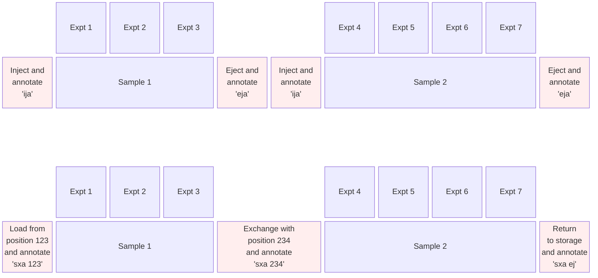

# Physical Sample Handling

These commands combine sample injection and ejection with metadata capture. If you already type `ij` and `ej` in TopSpin, you'll type `ija` and `eja` instead. The key concept: one sample annotation spans multiple experiments.

## How It Works

When you physically load a sample into the magnet, you create a sample annotation. When you remove it, you close the annotation. All experiments run in between are associated with that sample.


*One sample annotation spans multiple experiments. Top: Manual injection/ejection workflow. Bottom: SampleJet automated sample changer workflow.*

<!--

-->

## The Commands

### Manual Mode: `ija` and `eja`

**`ija` - inject and annotate**

Use this instead of TopSpin's standard `ij` command (turns off lift air to lower the sample).

What happens:

1. TopSpin lowers the sample (turns off lift air)
2. The samples app opens with a GUI form for data entry
3. You fill in sample details (all fields optional)
4. You save, creating a JSON file with the current timestamp

When to use: Every time you load a new sample into the magnet.

If a sample is already active in the current directory, you'll be prompted:

- Keep the existing sample active (if you're continuing with the same sample)
- Eject the existing sample first (if you're loading a different sample)

**`eja` - eject and annotate**

Use this instead of TopSpin's standard `ej` command (turns on lift air to raise the sample).

What happens:

1. TopSpin raises the sample (turns on lift air)
2. The active sample annotation is closed with an ejection timestamp
3. You can optionally add notes before closing

When to use: When you remove the sample from the magnet.

If no active sample exists, the command executes silently (just performs the physical ejection).

### Automated Mode: `sxa`

**`sxa [position|ej]` - SampleJet exchange and annotate**

Use this instead of TopSpin's standard `sx` command for automated sample changers.

What happens:

- `sxa 15` - Loads position 15 and opens the annotation form
- `sxa 234` - Ejects current sample, loads position 234, opens annotation form
- `sxa ej` - Ejects current sample and returns it to storage, closes annotation

The SampleJet position is automatically recorded in the sample metadata, giving you integrated position tracking with your annotations.

If you type `sxa` without an argument, you'll be prompted to enter a position number or `ej`.

## What Gets Recorded

Everything is optional. Fill in what matters for your work.

Here's an example of a typical annotation:

```
Sample: 15N-labelled ubiquitin, batch 2024-03
Concentration: 500 µM protein

Buffer: 20 mM sodium phosphate pH 6.5, 50 mM NaCl
Reference: 10 µM DSS

Tube: 5 mm Shigemi
Lab book: ELN-2024-156
```

### Available Fields

**People**

- Users (your name and collaborators)
- Research groups

**Sample**

- Label (e.g., "15N-ubiquitin pH 6.5")
- Components:
    - Name (e.g., "ubiquitin")
    - Concentration + unit (e.g., 500 µM)
    - Isotopic labelling (unlabelled, 15N, 13C, 15N-13C, 2H, etc)

**Buffer**

- Solvent (e.g., "10% D2O", "100% D2O")
- pH
- Chemical shift reference (e.g., "DSS", "TMS", "none")
- Components:
    - Name (e.g., "sodium phosphate")
    - Concentration + unit (e.g., 20 mM)

**NMR Tube**

- Diameter (5 mm, 3 mm, etc)
- Type (regular, Shigemi, thin-wall, etc)
- Sample volume (µL)
- SampleJet rack position (auto-filled if using `sxa`)
- SampleJet rack ID

**Laboratory References**

- Sample ID (your internal tracking code)
- Lab book entry (page reference or ELN identifier)

**Notes**

Free-form text field for anything that doesn't fit the structured fields.

## Getting Started with the Workflow

The behaviour change required is real - you need to remember to type `ija` instead of `ij`. Here's how to ease into it:

**1. Start with retrospective annotations**

Open the [samples app](samples-app.md), look at your timeline, and create annotations for recent data by selecting experiments. This teaches you the data model without any workflow changes.

**2. Use `ija` when you remember**

Don't worry if you forget - you can always create the annotation retrospectively. After a few times, it becomes automatic.

**3. Check the timeline**

The timeline view shows what you've annotated and what you've missed. Use this as a reminder to fill in gaps.

**4. After a few weeks, it becomes habit**

Like learning to save files or commit code, it becomes automatic. You'll find yourself typing `ija` without thinking.

## Why This Matters

**For you**: Six months from now, when you're writing up results, you won't be searching through lab notebooks wondering what the exact buffer composition was.

**For your thesis**: Complete experimental documentation with no effort during writing. Everything is already recorded and searchable.

**For data deposition**: Repositories like BMRB require detailed sample information. You already have it.

**For the group**: When you leave, your sample history stays behind. The next person can see exactly what you did.

## Transparent Prompts

All commands show transparent prompts explaining both the physical action and the metadata action before execution:

- Physical action: "This will turn off lift air to lower the sample"
- Metadata action: "This will open a form to annotate the sample"

You know exactly what's happening at each step.

---

**Next**: Explore the [Ecosystem](related.md) - web viewer for offline access, shared JSON schema for portability.

**Questions?** [Contact us](mailto:c.waudby@ucl.ac.uk) or [open an issue](https://github.com/waudbygroup/topspin-samples/issues).
