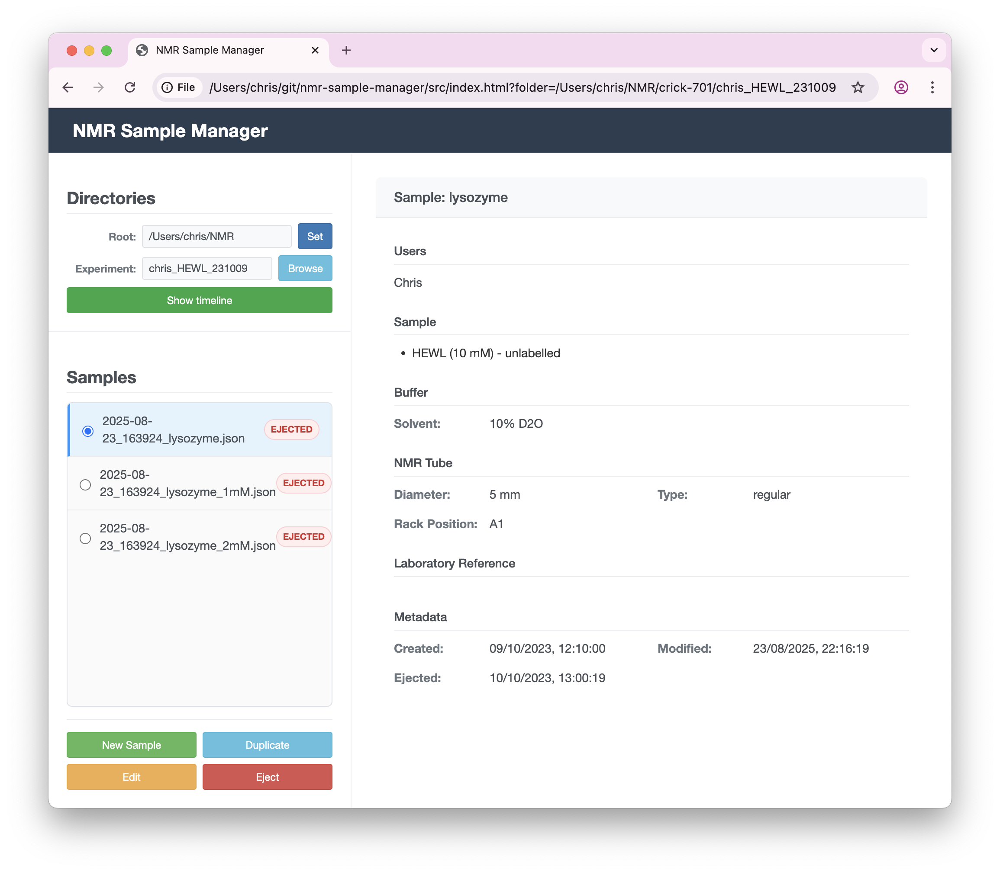

# Ecosystem

Sample Manager is part of an ecosystem built around a shared, open JSON schema. Sample metadata files are portable by design - they can be read and edited by multiple tools.

## NMR Sample Schema

**Repository:** [github.com/waudbygroup/nmr-sample-schema](https://github.com/waudbygroup/nmr-sample-schema)

The JSON schema that defines NMR sample metadata structure is maintained independently with semantic versioning. Maintaining the schema separately allows multiple tools to use the same standard and enables version control independent of application code.

All tools in the ecosystem use this shared schema, ensuring compatibility and data portability.

## NMR Sample Viewer

A web-based application for viewing and editing NMR sample metadata without TopSpin. Access at [waudbylab.org/nmr-samples/](http://waudbylab.org/nmr-samples/). Note that all data is stored locally - no information leaves your computer.

Features:

- Browser-based access with no installation required
- Works offline using the File System Access API
- Search and filtering across directories
- Bulk operations for creating and editing multiple samples

**Repository:** [github.com/waudbygroup/nmr-sample-viewer](https://github.com/waudbygroup/nmr-sample-viewer)

## NMRTools.jl

[NMRTools.jl](https://waudbylab.org/NMRTools.jl/) is a Julia library designed for handling common NMR data. Sample metadata will automatically be made available, if present, when loading NMR data. See the [documentation](https://waudbylab.org/NMRTools.jl/stable/metadata-samples/) for more information.
